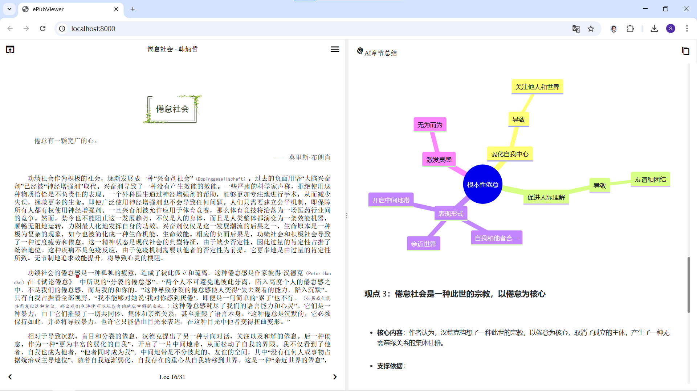

# ChapterAI - EPUB Chapter Analysis Assistant

[中文版本](README.md)

ChapterAI is an EPUB file chapter analysis tool that helps users quickly understand and extract the core content of articles. Through advanced AI technology, ChapterAI can automatically analyze article structure, extract key points, and generate clear visual charts.



[Preview](https://fengyukongzhou.github.io/2025/03/13/the-burnout-society/)

## Project Credits

Special thanks to the following open-source projects:
- [ePubViewer](https://github.com/pgaskin/ePubViewer) - Provided an excellent frontend interface foundation
- [3mintop](https://3min.top/) - Inspired the page layout
- [hikari0511/chapterAI](https://github.com/hikari0511/chapterAI) - This project is based on improvements and refactoring of this project 

## Features

- 🚀 Fast Analysis: Quickly complete article content analysis
- 📊 Visual Display: Automatically generate mind maps and flowcharts
- 🎯 Core Point Extraction: Accurately identify article highlights
- 💡 Smart Summary: Generate structured content overview
- 📋 Quick Copy: Support one-click copying of AI summary markdown text
- 🔄 OpenAI Format API Support: Compatible with API services that follow OpenAI interface format

## System Requirements

- Windows 10 or higher
- Python 3.8 or higher
- Browser (Chrome or Edge recommended)

## Installation

1. Clone or download this repository:
   ```bash
   git clone https://github.com/fengyukongzhou/ChapterAI.git
   cd chapterAI
   ```

2. Install dependencies:
   ```bash
   pip install -r requirements.txt
   ```

3. Edit Configuration: Create a new `.env` file and open it with a text editor. Copy the contents from `.env.example` and configure your API information.

## Usage

1. Double-click `start.bat`
2. Wait for the service to start, browser will automatically open to http://localhost:8000
3. Open your local epub file
4. Click the "AI Summary" button
5. Wait for analysis to complete and view results

## Configuration Guide

In the `api/.env` file, you can configure the following options:

```ini
# API General Configuration
API_BASE_URL=your_api_base_url_here    # Base URL for API service
API_KEY=your_api_key_here              # Your API key
MODEL_NAME=your_model_name_here        # Model name to use

# API General Settings
MAX_TOKENS=4096                        # Maximum tokens
TEMPERATURE=0.7                        # Text generation randomness

# Server Settings
PORT=8000                             # Server port
HOST=0.0.0.0                          # Server host address

# Development Settings
DEBUG=True                            # Debug mode
```

Please note:
- The `.env` file contains sensitive information and will not be committed to the Git repository
- You need to create your own `.env` file from `.env.example` during initial setup
- Keep your API key secure and never share it with others

## Project Structure

```
chapterAI/
├── api/                 # Backend code
│   ├── main.py         # Main server code
│   ├── config.py       # Configuration management
│   └── .env           # Environment variables
├── frontend/           # Frontend static files
│   ├── index.html     # Main page
│   ├── script.js      # Frontend logic
│   └── style.css      # Stylesheet
├── start.bat          # Startup script
└── requirements.txt   # Project dependencies
```

## FAQ

1. **Q: Port conflict error on startup?**  
   A: Ensure ports 8000 and 8001 are not in use by other programs. You can run in Command Prompt:
   ```bash
   netstat -ano | findstr :8000
   netstat -ano | findstr :8001
   ```
   Then use Task Manager to end the processes using these ports.

2. **Q: How to view service logs?**  
   A: Service logs will be displayed in the Command Prompt window when the service starts.

3. **Q: Python not installed or incorrect version?**  
   A: Download and install Python 3.8 or higher from the [Python website](https://www.python.org/downloads/). Make sure to check "Add Python to PATH" during installation.

## License

This project is licensed under the MIT License - see the [LICENSE](LICENSE) file for details.
